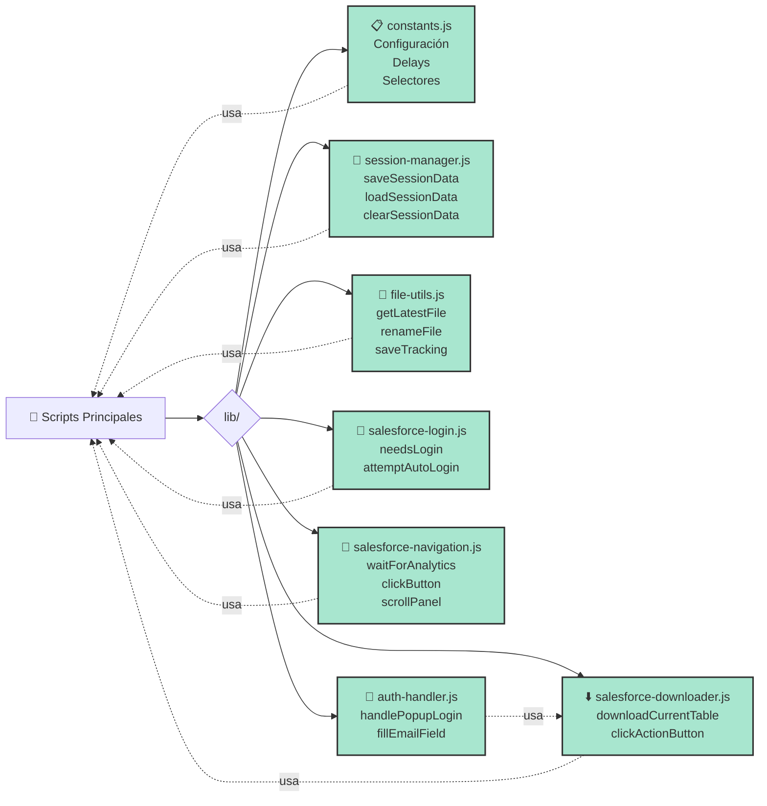
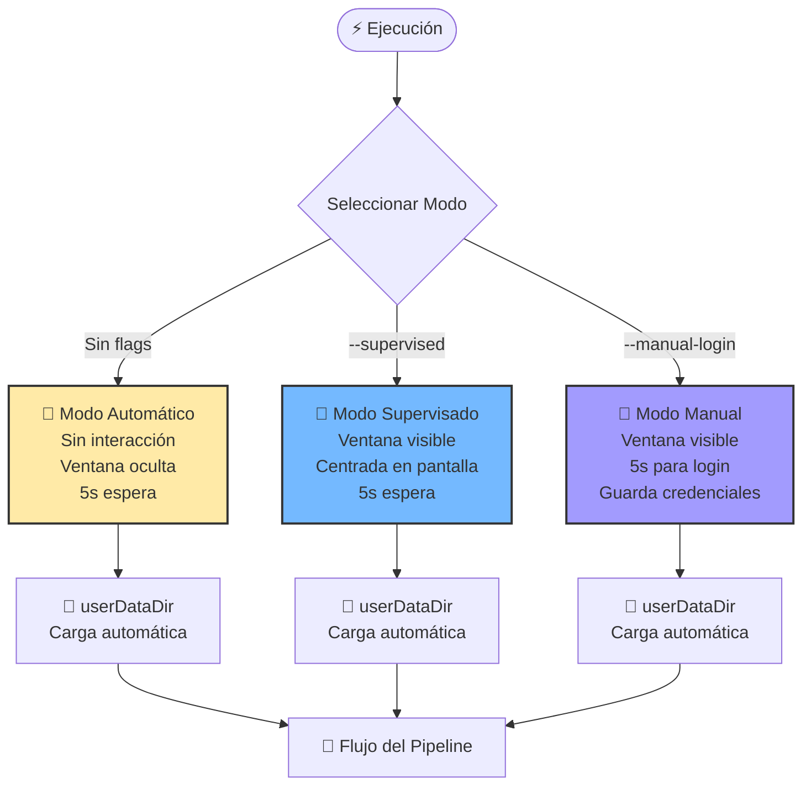
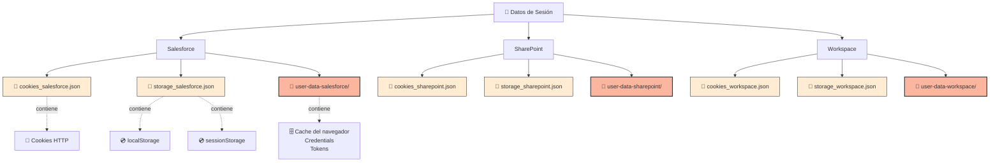
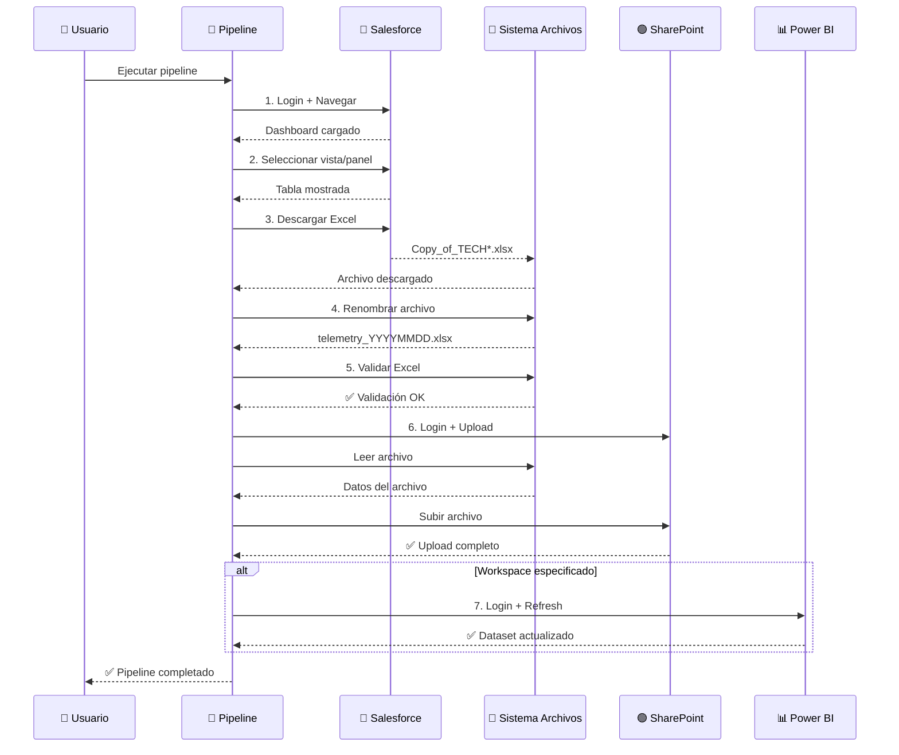
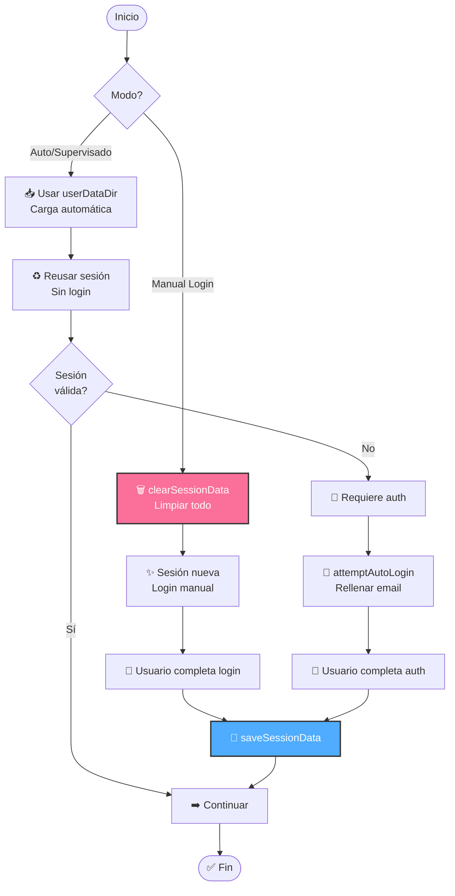

# 🔄 Flujo del Pipeline de Telemetría

## Diagrama de Flujo Completo

```mermaid
graph TB
    Start([🚀 Inicio]) --> Pipeline{run_full_pipeline.js}
    
    %% Configuración de argumentos
    Pipeline --> Args[📋 Parsear Argumentos<br/>--manual-login<br/>--supervised<br/>--workspace]
    
    Args --> Step1[📥 PASO 1/4<br/>download_telemetry.js]
    
    %% Paso 1: Download
    Step1 --> Browser1[🌐 Iniciar Browser<br/>userDataDir: user-data-salesforce]
    Browser1 --> Mode1{Modo?}
    
    Mode1 -->|Manual| Window1A[📍 Ventana Visible<br/>Manual Login]
    Mode1 -->|Supervisado| Window1B[📍 Ventana Centrada<br/>250,50]
    Mode1 -->|Automático| Window1C[📍 Ventana Oculta<br/>-2400,-2400]
    
    Window1A --> Nav1[🔗 Navegar a Salesforce]
    Window1B --> Nav1
    Window1C --> Nav1
    
    Nav1 --> Auth1{Necesita<br/>Login?}
    Auth1 -->|Sí| AutoLogin[🔐 attemptAutoLogin<br/>Introduce email]
    Auth1 -->|No| Dashboard[✅ Ya autenticado]
    AutoLogin --> Wait1
    Dashboard --> Wait1
    
    Wait1[⏱️ Esperar 5s<br/>DELAYS.LONG] --> Analytics[📊 Acceder a Analytics]
    
    Analytics --> ClickMV[👆 Click 'Mis vistas']
    ClickMV --> ClickPanel[👆 Click 'Paneles']
    ClickPanel --> Scroll[📜 Scroll al final]
    Scroll --> WaitTable[⏳ Esperar 30s<br/>Carga de tabla]
    
    WaitTable --> Download[⬇️ downloadCurrentTable]
    Download --> FindBtn[🔍 Buscar botón acciones]
    FindBtn --> MenuDL[📋 Click 'Descargar']
    MenuDL --> ClickExcel[📄 Click 'Excel']
    
    ClickExcel --> WaitDL[⏱️ Esperar 5s]
    WaitDL --> SaveSession1[💾 saveSessionData<br/>Cookies + Storage]
    
    SaveSession1 --> ProcessFile[📁 Buscar archivo<br/>Copy_of_TECH*.xlsx]
    ProcessFile --> Rename[✏️ Renombrar a<br/>telemetry_YYYYMMDD_HHMMSS.xlsx]
    Rename --> Track1[📝 Guardar path en<br/>last_downloaded_file.txt]
    
    Track1 --> Step2[🔍 PASO 2/4<br/>validate_excel.js]
    
    %% Paso 2: Validate
    Step2 --> ReadFile[📖 Leer archivo Excel]
    ReadFile --> CheckSheets{Validar<br/>Hojas}
    CheckSheets -->|Error| ValidationError[❌ Error: Hojas faltantes]
    CheckSheets -->|OK| CheckColumns[✓ Validar Columnas]
    CheckColumns -->|Error| ValidationError
    CheckColumns -->|OK| CheckData[✓ Validar Datos]
    CheckData -->|Error| ValidationError
    CheckData -->|OK| ValidationOK[✅ Validación exitosa]
    
    ValidationError --> End1([❌ Fin con error])
    ValidationOK --> Step3[📤 PASO 3/4<br/>upload_sp_telemetry.js]
    
    %% Paso 3: Upload
    Step3 --> Browser2[🌐 Iniciar Browser<br/>userDataDir: user-data-sharepoint]
    Browser2 --> Mode2{Modo?}
    
    Mode2 -->|Manual| Window2A[📍 Ventana Visible]
    Mode2 -->|Supervisado| Window2B[📍 Ventana Centrada]
    Mode2 -->|Automático| Window2C[📍 Ventana Oculta]
    
    Window2A --> Nav2[🔗 Navegar a SharePoint]
    Window2B --> Nav2
    Window2C --> Nav2
    
    Nav2 --> Wait2[⏱️ Esperar 10s]
    Wait2 --> SaveSession2[💾 saveSessionData]
    SaveSession2 --> UploadClick[👆 Click 'Cargar']
    
    UploadClick --> UploadFiles[👆 Click 'Archivos']
    UploadFiles --> Python[🐍 Lanzar upload.pyw<br/>Manejar dialog nativo]
    Python --> WaitUpload[⏳ Esperar 15s]
    WaitUpload --> SaveSession3[💾 saveSessionData]
    
    SaveSession3 --> CheckWS{Workspace<br/>especificado?}
    
    CheckWS -->|No| Success([✅ Pipeline Completo])
    CheckWS -->|Sí| Step4[🔄 PASO 4/4<br/>refresh_workspace.js]
    
    %% Paso 4: Refresh Workspace
    Step4 --> Browser3[🌐 Iniciar Browser<br/>userDataDir: user-data-workspace]
    Browser3 --> SelectWS{Workspace}
    
    SelectWS -->|kpis| URLKPIS[🔗 URL KPIS]
    SelectWS -->|defensa| URLDEF[🔗 URL Defensa]
    SelectWS -->|sectores| URLSEC[🔗 URL Sectores]
    
    URLKPIS --> NavWS[🔗 Navegar a Power BI]
    URLDEF --> NavWS
    URLSEC --> NavWS
    
    NavWS --> AuthWS{Necesita<br/>Login?}
    AuthWS -->|Sí| LoginWS[🔐 Completar Login]
    AuthWS -->|No| DatasetWS
    LoginWS --> DatasetWS[📊 Buscar Dataset]
    
    DatasetWS --> RefreshWS[🔄 Click Refresh]
    RefreshWS --> WaitRefresh[⏳ Esperar confirmación]
    WaitRefresh --> SaveSessionWS[💾 saveSessionData]
    
    SaveSessionWS --> Success
    
    %% Estilos
    classDef processClass fill:#667eea,stroke:#333,stroke-width:2px,color:#fff
    classDef decisionClass fill:#f093fb,stroke:#333,stroke-width:2px,color:#fff
    classDef successClass fill:#4facfe,stroke:#333,stroke-width:3px,color:#fff
    classDef errorClass fill:#fa709a,stroke:#333,stroke-width:2px,color:#fff
    classDef dataClass fill:#ffecd2,stroke:#333,stroke-width:2px,color:#333
    
    class Step1,Step2,Step3,Step4,Download,UploadClick,RefreshWS processClass
    class Mode1,Mode2,CheckWS,SelectWS,Auth1,AuthWS,CheckSheets decisionClass
    class Success successClass
    class End1,ValidationError errorClass
    class SaveSession1,SaveSession2,SaveSession3,SaveSessionWS,Track1 dataClass
```



## 📦 Módulos de Soporte (lib/)



## 🎯 Modos de Ejecución



## 🗂️ Estructura de Datos de Sesión



## 🚀 Comandos de Ejecución

### Pipeline Completo
```bash
# Modo automático (sin ventanas visibles)
node run_full_pipeline.js

# Modo supervisado (ventana visible)
node run_full_pipeline.js --supervised

# Modo manual (para actualizar credenciales)
node run_full_pipeline.js --manual-login

# Con actualización de workspace
node run_full_pipeline.js --workspace kpis
node run_full_pipeline.js --supervised --workspace defensa
```

### Scripts Individuales
```bash
# Solo descargar
node download_telemetry.js
node download_telemetry.js --supervised
node download_telemetry.js --manual-login

# Solo validar
node validate_excel.js

# Solo subir
node upload_sp_telemetry.js
node upload_sp_telemetry.js --supervised

# Solo actualizar workspace
node refresh_workspace.js --workspace kpis
node refresh_workspace.js --workspace defensa --supervised
```

## 📊 Flujo de Datos



## 🔒 Gestión de Credenciales



---

**Leyenda:**
- 🔵 Salesforce Analytics
- 🟢 SharePoint
- 📊 Power BI
- 💾 Almacenamiento de sesión
- 🔐 Autenticación
- 📁 Sistema de archivos
- ⏱️ Esperas/Delays
