#  SyncShark - Telefónica Tech

**Automatización del proceso de descarga, validación y publicación de telemetría de negocio desde Salesforce Analytics hacia Power BI.**


## 🚀 Instalación Rápida

### Para Usuarios

1. **Descargar**: Haz clic en **"Code"** → **"Download ZIP"**
2. **Descomprimir** en cualquier carpeta
3. **Ejecutar** `install.bat` (doble clic)
4. **Configurar** credenciales en `src\.env`
5. **Usar** acceso directo en el escritorio

Ver [INSTALL-GUIDE.md](INSTALL-GUIDE.md) para más detalles.

### Requisitos

- Node.js 18+ ([Descargar](https://nodejs.org/))
- Python 3.8+ ([Descargar](https://www.python.org/downloads/))
- Git (opcional, para actualizaciones automáticas)

---

## Descripción

Sistema automatizado que elimina la intervención manual en el flujo de datos de telemetría, reduciendo el tiempo de procesamiento de ~30 minutos a menos de 5 minutos y eliminando errores humanos en la manipulación de datos.

### ✨ Características Principales

- 🎯 **Instalación con 1 clic** - Instalador automático sin configuración manual
- 🔄 **Auto-actualización** - Notificaciones automáticas de nuevas versiones
- 🖥️ **Interfaz gráfica profesional** - Aplicación Electron con logs en tiempo real
- 🔐 **Gestión inteligente de sesiones** - Login automático con persistencia de credenciales
- 📊 **Validación automática** - Verificación de integridad de datos
- 🚫 **Sin ventanas molestas** - Ejecución invisible sin terminales

### Problema Resuelto

Anteriormente, el proceso requería:
- Login manual en Salesforce Analytics
- Navegación manual por múltiples menús
- Descarga manual de tablas
- Validación manual del formato Excel
- Subida manual a SharePoint
- Actualización manual de datasets en Power BI

**Resultado:** Proceso propenso a errores, lento y que requería dedicación diaria de personal técnico.

### Solución Implementada

Pipeline completamente automatizado con interfaz gráfica que ejecuta todo el flujo con un solo clic, incluyendo manejo inteligente de sesiones, validación automática de datos y sistema profesional de actualizaciones.

---

## Flujo del Proceso

El sistema ejecuta los siguientes pasos de forma secuencial y automática:

### 1. Autenticación en Salesforce
- Carga de sesión guardada o login automático
- Manejo de autenticación de dos factores (ventana de 60s para completar)
- Persistencia de credenciales para ejecuciones futuras

### 2. Navegación en Salesforce Analytics
- Acceso al dashboard específico de telemetría
- Navegación automática por la estructura de menús:
  - "Mis vistas" → "Paneles"
- Scroll automático para cargar contenido dinámico
- Espera inteligente para carga completa de datos

### 3. Descarga de Datos
- Localización del botón de acciones de tabla
- Click en "Exportar" → "Excel con formato"
- Gestión del diálogo de descarga de Windows (pywinauto)
- Detección automática del archivo descargado más reciente

### 4. Validación y Preparación del Archivo
- Verificación de integridad del archivo Excel
- Corrección automática de formato para compatibilidad con Power BI
- Renombrado con fecha actual (formato: `telemetry_YYYYMMDD.xlsx`)
- Registro de ruta para el siguiente paso

### 5. Publicación en SharePoint
- Autenticación en SharePoint (sesión persistente)
- Navegación a la biblioteca de documentos específica
- Subida del archivo validado
- Verificación de carga exitosa

### 6. Actualización de Datasets en Power BI (Opcional)
- Acceso al workspace específico (KPIS/Defensa/Sectores)
- Trigger de actualización del dataset
- Confirmación de inicio de actualización

---

## Valor de Negocio

### Beneficios Cuantificables
- **Reducción de tiempo:** De 30 min → 5 min por ejecución (83% mejora)
- **Eliminación de errores:** 0 errores de formato desde implementación
- **Automatización:** 100% del proceso sin intervención manual
- **Disponibilidad:** Ejecución bajo demanda, cualquier momento del día

### Beneficios Cualitativos
- Liberación de tiempo técnico para tareas de mayor valor
- Datos siempre actualizados y consistentes
- Trazabilidad completa del proceso
- Reducción de dependencias en personal específico
- Múltiples modos de ejecución para diferentes escenarios
- Gestión flexible de credenciales y sesiones

---

## Flujo del Pipeline

Para una visualización completa y detallada del flujo del sistema, consultar [FLUJO.md](FLUJO.md)

### Diagrama de Flujo Completo

```mermaid
graph TB
    Start([🚀 Inicio]) --> Pipeline{run_full_pipeline.js}
    
    %% Configuración de argumentos
    Pipeline --> Args[📋 Parsear Argumentos<br/>--manual-login<br/>--supervised<br/>--workspace]
    
    Args --> Step1[📥 PASO 1/4<br/>download_telemetry.js]
    
    %% Paso 1: Download
    Step1 --> Browser1[🌐 Iniciar Browser<br/>userDataDir: user-data-salesforce]
    Browser1 --> Mode1{Modo?}
    
    Mode1 -->|Manual| Window1A[📍 Ventana Visible<br/>Manual Login]
    Mode1 -->|Supervisado| Window1B[📍 Ventana Centrada<br/>250,50]
    Mode1 -->|Automático| Window1C[📍 Ventana Oculta<br/>-2400,-2400]
    
    Window1A --> Nav1[🔗 Navegar a Salesforce]
    Window1B --> Nav1
    Window1C --> Nav1
    
    Nav1 --> Auth1{Necesita<br/>Login?}
    Auth1 -->|Sí| AutoLogin[🔐 attemptAutoLogin<br/>Introduce email]
    Auth1 -->|No| Dashboard[✅ Ya autenticado]
    AutoLogin --> Wait1
    Dashboard --> Wait1
    
    Wait1[⏱️ Esperar 5s<br/>DELAYS.LONG] --> Analytics[📊 Acceder a Analytics]
    
    Analytics --> ClickMV[👆 Click 'Mis vistas']
    ClickMV --> ClickPanel[👆 Click 'Paneles']
    ClickPanel --> Scroll[📜 Scroll al final]
    Scroll --> WaitTable[⏳ Esperar 30s<br/>Carga de tabla]
    
    WaitTable --> Download[⬇️ downloadCurrentTable]
    Download --> FindBtn[🔍 Buscar botón acciones]
    FindBtn --> MenuDL[📋 Click 'Descargar']
    MenuDL --> ClickExcel[📄 Click 'Excel']
    
    ClickExcel --> WaitDL[⏱️ Esperar 5s]
    WaitDL --> SaveSession1[💾 saveSessionData<br/>Cookies + Storage]
    
    SaveSession1 --> ProcessFile[📁 Buscar archivo<br/>Copy_of_TECH*.xlsx]
    ProcessFile --> Rename[✏️ Renombrar a<br/>telemetry_YYYYMMDD_HHMMSS.xlsx]
    Rename --> Track1[📝 Guardar path en<br/>last_downloaded_file.txt]
    
    Track1 --> Step2[🔍 PASO 2/4<br/>validate_excel.js]
    
    %% Paso 2: Validate
    Step2 --> ReadFile[📖 Leer archivo Excel]
    ReadFile --> CheckSheets{Validar<br/>Hojas}
    CheckSheets -->|Error| ValidationError[❌ Error: Hojas faltantes]
    CheckSheets -->|OK| CheckColumns[✓ Validar Columnas]
    CheckColumns -->|Error| ValidationError
    CheckColumns -->|OK| CheckData[✓ Validar Datos]
    CheckData -->|Error| ValidationError
    CheckData -->|OK| ValidationOK[✅ Validación exitosa]
    
    ValidationError --> End1([❌ Fin con error])
    ValidationOK --> Step3[📤 PASO 3/4<br/>upload_sp_telemetry.js]
    
    %% Paso 3: Upload
    Step3 --> Browser2[🌐 Iniciar Browser<br/>userDataDir: user-data-sharepoint]
    Browser2 --> Mode2{Modo?}
    
    Mode2 -->|Manual| Window2A[📍 Ventana Visible]
    Mode2 -->|Supervisado| Window2B[📍 Ventana Centrada]
    Mode2 -->|Automático| Window2C[📍 Ventana Oculta]
    
    Window2A --> Nav2[🔗 Navegar a SharePoint]
    Window2B --> Nav2
    Window2C --> Nav2
    
    Nav2 --> Wait2[⏱️ Esperar 10s]
    Wait2 --> SaveSession2[💾 saveSessionData]
    SaveSession2 --> UploadClick[👆 Click 'Cargar']
    
    UploadClick --> UploadFiles[👆 Click 'Archivos']
    UploadFiles --> Python[🐍 Lanzar upload.pyw<br/>Manejar dialog nativo]
    Python --> WaitUpload[⏳ Esperar 15s]
    WaitUpload --> SaveSession3[💾 saveSessionData]
    
    SaveSession3 --> CheckWS{Workspace<br/>especificado?}
    
    CheckWS -->|No| Success([✅ Pipeline Completo])
    CheckWS -->|Sí| Step4[🔄 PASO 4/4<br/>refresh_workspace.js]
    
    %% Paso 4: Refresh Workspace
    Step4 --> Browser3[🌐 Iniciar Browser<br/>userDataDir: user-data-workspace]
    Browser3 --> SelectWS{Workspace}
    
    SelectWS -->|kpis| URLKPIS[🔗 URL KPIS]
    SelectWS -->|defensa| URLDEF[🔗 URL Defensa]
    SelectWS -->|sectores| URLSEC[🔗 URL Sectores]
    
    URLKPIS --> NavWS[🔗 Navegar a Power BI]
    URLDEF --> NavWS
    URLSEC --> NavWS
    
    NavWS --> AuthWS{Necesita<br/>Login?}
    AuthWS -->|Sí| LoginWS[🔐 Completar Login]
    AuthWS -->|No| DatasetWS
    LoginWS --> DatasetWS[📊 Buscar Dataset]
    
    DatasetWS --> RefreshWS[🔄 Click Refresh]
    RefreshWS --> WaitRefresh[⏳ Esperar confirmación]
    WaitRefresh --> SaveSessionWS[💾 saveSessionData]
    
    SaveSessionWS --> Success
    
    %% Estilos
    classDef processClass fill:#667eea,stroke:#333,stroke-width:2px,color:#fff
    classDef decisionClass fill:#f093fb,stroke:#333,stroke-width:2px,color:#fff
    classDef successClass fill:#4facfe,stroke:#333,stroke-width:3px,color:#fff
    classDef errorClass fill:#fa709a,stroke:#333,stroke-width:2px,color:#fff
    classDef dataClass fill:#ffecd2,stroke:#333,stroke-width:2px,color:#333
    
    class Step1,Step2,Step3,Step4,Download,UploadClick,RefreshWS processClass
    class Mode1,Mode2,CheckWS,SelectWS,Auth1,AuthWS,CheckSheets decisionClass
    class Success successClass
    class End1,ValidationError errorClass
    class SaveSession1,SaveSession2,SaveSession3,SaveSessionWS,Track1 dataClass
```



### Stack Tecnológico

**Backend:**
- **Node.js** - Runtime principal
- **Puppeteer** - Automatización del navegador (Chromium)
- **Python 3** - Interoperabilidad con Windows (pywinauto)

**Frontend:**
- **Electron** - Aplicación de escritorio multiplataforma
- **HTML/CSS/JavaScript** - Interfaz gráfica

**Librerías Clave:**
- `puppeteer` - Control de navegador headless/headed
- `dotenv` - Gestión de variables de entorno
- `pywinauto` - Automatización de diálogos nativos de Windows

---

## Estructura del Proyecto

```
node-project/
│
├── src/                        # Todo el código fuente
│   │
│   ├── electron/              # Aplicación Electron (GUI)
│   │   ├── index.html        # Interfaz principal
│   │   ├── renderer.js       # Lógica de UI
│   │   ├── main.js           # Proceso principal Electron
│   │   └── preload.js        # Puente seguro IPC
│   │
│   ├── lib/                  # Módulos reutilizables
│   │   ├── constants.js      # Configuración global
│   │   ├── file-utils.js     # Utilidades de archivos
│   │   ├── session-manager.js # Gestión de sesiones
│   │   ├── auth-handler.js   # Autenticación
│   │   ├── salesforce-login.js # Login en Salesforce
│   │   ├── salesforce-navigation.js # Navegación UI Salesforce
│   │   └── salesforce-downloader.js # Descarga de tablas
│   │
│   ├── session-data/         # Datos de sesión persistentes
│   │   ├── salesforce/      # Sesiones de Salesforce
│   │   │   ├── cookies_salesforce.json
│   │   │   └── storage_salesforce.json
│   │   ├── sharepoint/      # Sesiones de SharePoint
│   │   │   ├── cookies_sharepoint.json
│   │   │   └── storage_sharepoint.json
│   │   └── workspace/       # Sesiones de Power BI
│   │       ├── cookies_workspace.json
│   │       └── storage_workspace.json
│   │
│   ├── user-data-*/         # Perfiles del navegador (Chromium)
│   │   ├── user-data-salesforce/
│   │   ├── user-data-sharepoint/
│   │   └── user-data-workspace/
│   │
│   ├── assets/              # Recursos estáticos
│   │   ├── logo.png        # Logo corporativo
│   │   └── welcome_screen.jpg # Pantalla de bienvenida
│   │
│   ├── Scripts principales
│   ├── run_full_pipeline.js  # Orquestador principal
│   ├── download_telemetry.js # Paso 1: Descarga
│   ├── validate_excel.js     # Paso 2: Validación
│   ├── upload_sp_telemetry.js # Paso 3: Subida
│   ├── refresh_workspace.js  # Paso 4: Actualización BI
│   ├── clear-credentials.js  # Borrado de credenciales
│   ├── check-config.js       # Validación de configuración
│   │
│   ├── Utilidades Python
│   ├── upload.pyw           # Helper para diálogos Windows (sin ventana)
│   ├── prepare_upload.js    # Preparación de archivos
│   │
│   ├── Lanzamiento
│   ├── launch.vbs           # Lanzador silencioso de Electron
│   ├── launch.bat           # Lanzador alternativo con consola
│   │
│   ├── Configuración
│   ├── package.json         # Dependencias Node.js
│   ├── .env                 # Variables de entorno (NO en git)
│   │
│   └── Documentación técnica
│       └── FLUJO.md         # Documentación detallada del flujo
│
├── Documentación
├── README.md                 # Este archivo
├── INSTALLATION.md           # Guía de instalación
├── FLUJO.md                  # Diagrama de flujo del pipeline
│
├── Instalación
└── setup.bat                 # Script de instalación (llama a src/setup.ps1)
```

---

## Patrones de Diseño Implementados

### 1. Separation of Concerns
---

## 📂 Estructura del Proyecto

```
SyncShark/
├── install.bat              # Instalador automático
├── launch.vbs               # Lanzador invisible (sin terminal)
├── publish-release.bat      # Publicar releases (solo admin)
├── INSTALL-GUIDE.md         # Guía de instalación
├── RELEASES.md              # Documentación de releases
├── src/
│   ├── .env                 # Configuración y credenciales
│   ├── package.json         # Dependencias del proyecto
│   ├── electron/            # Aplicación de escritorio
│   │   ├── main.js          # Proceso principal + Auto-updater
│   │   ├── renderer.js      # Lógica de UI
│   │   ├── preload.js       # Puente seguro IPC
│   │   └── index.html       # Interfaz gráfica
│   ├── lib/                 # Módulos principales
│   │   ├── auto-updater.js  # Sistema de actualizaciones
│   │   ├── auth-handler.js
│   │   ├── constants.js
│   │   ├── file-utils.js
│   │   ├── salesforce-downloader.js
│   │   ├── salesforce-login.js
│   │   ├── salesforce-navigation.js
│   │   └── session-manager.js
│   ├── run_full_pipeline.js # Orquestador principal
│   ├── download_telemetry.js
│   ├── validate_excel.js
│   ├── upload_sp_telemetry.js
│   ├── upload.pyw           # Gestor de diálogos Windows
│   └── refresh_workspace.js
└── session-data/            # Datos de sesión persistentes
    ├── salesforce/
    ├── sharepoint/
    └── workspace/
```

---

## 🚀 Uso

### Ejecución desde Electron GUI

1. Doble clic en el acceso directo del escritorio (o `launch.vbs`)
2. Seleccionar modo de ejecución:
   - **Automático**: Completamente invisible
   - **Supervisado**: Ventana visible para supervisión
   - **Manual**: Para completar login manualmente
3. Seleccionar workspace a actualizar (opcional):
   - KPIS / Defensa / Sectores / Nada
4. Click en el botón correspondiente
5. Ver logs en tiempo real

### Modos de Ejecución

#### 🤖 Modo Automático (Recomendado)
- Ejecución completamente invisible
- Login automático si hay sesión guardada
- Ideal para ejecución diaria

#### 👁️ Modo Supervisado
- Ventana visible pero automatizada
- Útil para verificar el proceso
- Debugging y resolución de problemas

#### 👤 Modo Manual
- Login manual en Salesforce
- Resto del proceso automático
- Para autenticación 2FA

### Actualización de Credenciales

1. Desde la GUI: Click en "Actualizar Credenciales Workspace"
2. Completa el login en el navegador que se abre
3. Las credenciales se guardan automáticamente

### Borrar Credenciales

Click en "⚠️ Borrar TODAS las Credenciales" para resetear todas las sesiones guardadas.

---

## 🔄 Sistema de Actualizaciones

SyncShark incluye un sistema profesional de auto-actualización:

- ✅ **Verificación automática** al iniciar la aplicación
- ✅ **Notificación elegante** cuando hay nueva versión
- ✅ **Actualización con 1 clic** - Descarga e instala automáticamente
- ✅ **Backup automático** - Restauración en caso de error
- ✅ **Changelog integrado** - Ver qué cambió en cada versión

Ver [RELEASES.md](RELEASES.md) para más detalles sobre el sistema de releases.

---

## 🛠️ Arquitectura Técnica

### Principios de Diseño

#### 1. Separación de Responsabilidades
Cada módulo tiene una responsabilidad única y bien definida:
- `session-manager.js`: Solo gestión de sesiones
- `salesforce-navigation.js`: Solo navegación en UI
- `file-utils.js`: Solo operaciones de archivos
- `auto-updater.js`: Solo sistema de actualizaciones

#### 2. Dependency Injection
Los módulos reciben dependencias como parámetros (page, browser) en lugar de crearlas internamente.

#### 3. Error Handling
Manejo consistente de errores con try-catch y códigos de salida apropiados.

#### 4. Configuration Management
Centralización de configuración en `constants.js` y variables de entorno.

#### 5. State Persistence
Uso de `userDataDir` de Puppeteer para persistir sesiones del navegador.

---

## 📋 Requisitos del Sistema

### Software Requerido
- **Node.js** 18+ (incluye npm)
- **Python** 3.8+
- **Git** (opcional, para actualizaciones automáticas)
- **Windows** 10 o superior

### Dependencias Node.js
```json
{
  "puppeteer": "^24.29.0",
  "dotenv": "^17.2.3",
  "electron": "^39.2.7",
  "n8n": "^1.118.1"
}
```

### Dependencias Python
```
pywinauto
```

El instalador `install.bat` se encarga de instalar todas las dependencias automáticamente.
3. Ejecutar aplicación desde acceso directo del escritorio

---

## Uso

### Interfaz Gráfica

La interfaz ofrece tres modos de ejecución y gestión de credenciales:

#### Modos de Ejecución

**🔵 Ejecución Automática:** 
- Pipeline completo en segundo plano (ventana minimizada)
- Usa sesiones guardadas
- Sin intervención del usuario
- **Recomendado para uso diario**

**🟢 Automático Supervisado:**
- Pipeline completo con ventanas visibles
- Usa sesiones guardadas
- Permite supervisar el proceso en tiempo real
- Útil para monitoreo o resolución de problemas

**🟡 Login Manual:**
- Pipeline completo con ventanas visibles
- Actualiza credenciales (60 segundos para login)
- Recomendado si las credenciales expiraron
- Las credenciales se actualizan automáticamente, no se borran

#### Gestión de Credenciales

**Actualizar Credenciales Workspace:**
- Refresca solo las credenciales de Power BI Workspace
- Útil si expira la sesión de Power BI

**⚠️ Borrar TODAS las Credenciales:**
- Botón rojo con confirmación obligatoria
- Elimina todas las sesiones guardadas (Salesforce, SharePoint, Power BI)
- Requiere volver a hacer login en todos los servicios
- Usar solo cuando sea necesario renovar todas las sesiones

#### Actualización de Workspaces

**Actualizar Solo Workspace:**
- Seleccionar workspace (KPIS/Defensa/Sectores)
- Solo ejecuta actualización del dataset en Power BI
- No descarga ni sube archivos

### Línea de Comandos

```bash
---

## 👨‍💻 Para Desarrolladores

### Publicar Nueva Versión

```bash
# Commitear todos los cambios
git add .
git commit -m "feat: Nueva funcionalidad"
git push

# Publicar release (actualiza version, crea tag, sube a GitHub)
.\publish-release.bat
```

El script `publish-release.bat`:
1. ✅ Verifica que estés en main/master sin cambios pendientes
2. ✅ Actualiza la versión en package.json
3. ✅ Crea commit y tag con la nueva versión
4. ✅ Hace push a GitHub
5. ✅ Abre la página para completar las notas del release

Ver [RELEASES.md](RELEASES.md) para documentación completa del sistema de releases.

### Estructura Modular

#### Scripts de Pipeline
- `run_full_pipeline.js` - Orquestador principal que ejecuta todo el flujo
- `download_telemetry.js` - Descarga desde Salesforce Analytics
- `validate_excel.js` - Validación de formato Excel
- `upload_sp_telemetry.js` - Subida a SharePoint
- `refresh_workspace.js` - Actualización de Power BI

#### Librerías Compartidas
- `lib/auth-handler.js` - Gestión de autenticación
- `lib/session-manager.js` - Persistencia de sesiones
- `lib/salesforce-*` - Módulos específicos de Salesforce
- `lib/file-utils.js` - Utilidades de archivos
- `lib/constants.js` - Configuración centralizada
- `lib/auto-updater.js` - Sistema de actualizaciones

#### Aplicación Electron
- `electron/main.js` - Proceso principal + verificación de actualizaciones
- `electron/renderer.js` - Lógica de interfaz de usuario
- `electron/preload.js` - Comunicación segura IPC
- `electron/index.html` - Interfaz gráfica

### Ejecución por Terminal (Desarrollo)

```bash
# Desde la carpeta src/

# Pipeline completo (automático, minimizado)
node run_full_pipeline.js

# Pipeline supervisado (ventanas visibles)
node run_full_pipeline.js --supervised

# Pipeline con login manual (actualiza credenciales)
node run_full_pipeline.js --manual-login

# Combinación de flags
node run_full_pipeline.js --manual-login --supervised --workspace kpis

# Solo descarga (minimizado)
node download_telemetry.js

# Solo descarga (supervisado)
node download_telemetry.js --supervised

# Solo validación
node validate_excel.js

# Solo subida
node upload_sp_telemetry.js

# Solo actualización workspace
node refresh_workspace.js --workspace defensa

# Borrar todas las credenciales
node clear-credentials.js

# Scripts de utilidad
node check-config.js  # Validar configuración
```

---

## Configuración

### Variables de Entorno (.env)

```env
# Salesforce
SALESFORCE_URL=https://...
SF_USER=usuario@telefonica.com

# SharePoint
SHAREPOINT_URL=https://...

# Power BI Workspaces
WORKSPACE_URL=https://...
KPIS_URL=https://...
DEFENSA_URL=https://...
SECTORES_URL=https://...

# Workspace (opcional)
WORKSPACE_USER=usuario@telefonica.com
WORKSPACE_PASSWORD=contraseña

# Sistema (opcional)
DOWNLOADS_DIR=C:\Users\Usuario\Downloads
```

---

## Seguridad

### Datos Sensibles
- Credenciales almacenadas solo localmente
- Archivos de sesión excluidos de git (.gitignore)
- Variables de entorno para configuración sensible
- Sin hardcoding de contraseñas en código

### Sesiones
- Cookies y tokens almacenados en `user-data-*/`
- Persistencia opcional para evitar logins repetitivos
- Limpieza manual disponible cuando sea necesario

---

## Monitoreo y Logs

### Logs en Tiempo Real
La GUI muestra todos los pasos del proceso con códigos de color:
- Azul: Información
- Verde: Éxito
- Amarillo: Advertencia
- Rojo: Error

### Códigos de Salida
- `0`: Éxito
- `1`: Error en ejecución

---

## Mantenimiento

### Actualización de Selectores
Si la UI de Salesforce cambia, actualizar selectores en:
- `lib/constants.js`: `ANALYTICS_CONTAINER_SELECTORS`
- `lib/salesforce-navigation.js`: Funciones de click

### Actualización de URLs
Modificar URLs en archivo `.env` sin tocar código fuente.

### Actualización de Tiempos
Ajustar tiempos de espera en `lib/constants.js` → `DELAYS`

---

## Troubleshooting

### El navegador no se abre
- Verificar que Chromium de Puppeteer esté instalado
- Ejecutar `npm install` nuevamente

### Errores de autenticación
- **Opción 1 (recomendada):** Usar modo "Login Manual" (actualiza credenciales)
- **Opción 2:** Botón "Borrar TODAS las Credenciales" en la GUI
- **Opción 3 (manual):** Eliminar carpetas `user-data-*` y `session-data/*`
- **Opción 4 (CLI):** Ejecutar `node clear-credentials.js`

### Archivo no se descarga
- Verificar permisos en directorio de descargas
- Verificar espacio en disco

### No encuentra el archivo descargado
- Verificar variable `DOWNLOADS_DIR` en `.env`
- Aumentar `DELAYS.DOWNLOAD_COMPLETE` en constants.js

---

## Roadmap Futuro

- Notificaciones por email al completar pipeline
- Dashboard de métricas de ejecución
- Scheduler integrado para ejecución automática diaria
- Soporte para múltiples fuentes de datos
- API REST para integración con otros sistemas

---

## Contribución

Para contribuir al proyecto:
1. Revisar estructura modular existente
2. Seguir patrones de diseño implementados
3. Documentar cambios en código
4. Actualizar README si se agregan features

---

## Licencia

Uso interno - Telefónica Tech

---

## Autor

**Desarrollado por:** Jaime Vidal

**Empresa:** Telefónica Tech

**Año:** 2026

---

## Documentación Adicional

- [INSTALLATION.md](INSTALLATION.md) - Guía de instalación paso a paso
- [FLUJO.md](FLUJO.md) - Diagrama de flujo detallado del pipeline
